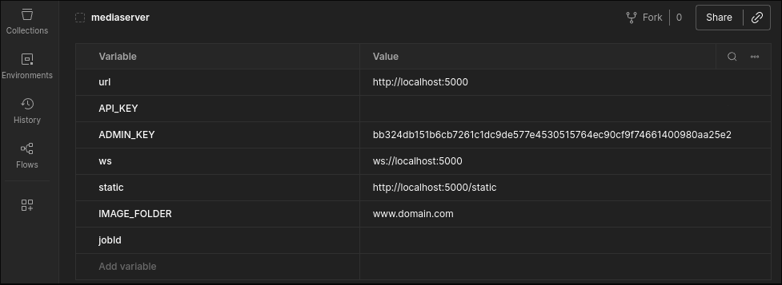
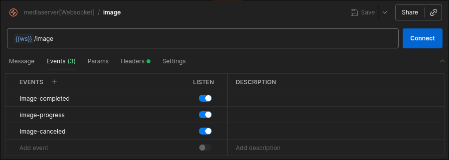
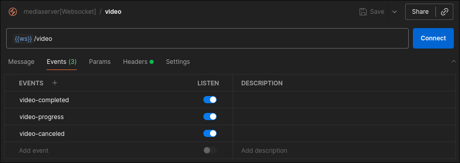
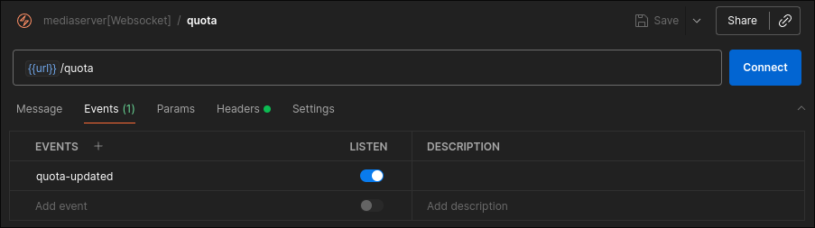

# MediaServer API

A **scalable, multi-tenant media server API** built with **NestJS** and **Fastify**, designed to handle **image and video uploads, conversion, transcoding, and storage management**.  
All operations provide **real-time updates via WebSockets**, making it ideal for dashboards or delegating media handling from other backends.

---

## Features

- **Image Handling**
  - Upload images.
  - Convert to **WebP** for optimized web delivery.
  - Supports common web image contexts and responsive use cases.

- **Video Handling**
  - Upload videos.
  - Transcode to **WebM** by default; supports scaling to any format.

- **Real-Time Feedback**
  - All uploads, conversions, and background jobs report progress via **WebSockets**.
  - Provides percentage, messages, and status updates in real time.

- **Multi-Language Support**
  - Powered by `nestjs-i18n`.
  - Easily extendable to any locale.

- **Multi-Tenant**
  - Accounts created with **name** and **domain**.
  - Each account gets a dedicated storage folder.

- **Storage & Quota Management**
  - Tracks user storage usage and transfer limits.
  - Prevents over-quota uploads automatically.
  - Works with **local storage by default**, but can be adapted to **S3 or other cloud storage**.

- **Queue-Based Processing**
  - Uses **BullMQ** + **Redis** for async media tasks.
  - Fully scalable for high load and concurrent jobs.

- **Architecture**
  - Hexagonal architecture for maintainability.
  - **PostgreSQL** + **TypeORM** for persistent storage.
  - **Pino** logging for high-performance logging.
  - **Fastify** for high-speed HTTP handling.
  - Compiled with **SWC** for fast builds.

## Requirements

Before running the MediaServer API, make sure you have the following services installed and running:

- **Node.js** ≥ 20
- **pnpm** (or npm/yarn)
- **Redis** ≥ 7
  - Used by **BullMQ** for queue-based background jobs.
  - Default connection: `redis://localhost:6379` (configurable via `.env`).
- **PostgreSQL** ≥ 15
  - Stores accounts, images, quotas, and other persistent data.
  - Default connection via `.env` variables:
    ```env
    DB_HOST=localhost
    DB_PORT=5432
    DB_USERNAME=youruser
    DB_PASSWORD=yourpassword
    DB_NAME=mediaserver
    ```
- **Optional:** Storage folder or S3 bucket for media files
  - By default, local storage is used. Configure `STORAGE_PATH` in `.env`.

---

## Installation

```bash
git clone https://github.com/yourusername/mediaserver-api.git
cd mediaserver
pnpm install
```

### Build and Run

Migrate the database and start the server:

```bash
pnpm run migration:run
```

Start the server(development):

```bash
pnpm run start:dev
```

**See it on action:**

- `MEDIASERVER` identifies your backend instance to the MediaServer WebSocket endpoints.
- Once set, all **quota updates, image uploads, and video transcoding progress** are automatically emitted to connected clients.
- Create a Postman environment variable like this, and use it in your requests:
  

---

## Testing in Postman

## Import Postman Collection

To simplify testing, a pre-made Postman collection is included in the repository:

- File: [`mediaserver.postman_collection.json`](https://raw.githubusercontent.com/jonymoraes/mediaserver/refs/heads/master/data/mediaserver.postman_collection.json)
- Download the file or import it directly in Postman:

1. Click **Import** in Postman.
2. Select **Link**.
3. Paste the URL: [https://raw.githubusercontent.com/jonymoraes/mediaserver/refs/heads/master/data/mediaserver.postman_collection.json](https://raw.githubusercontent.com/jonymoraes/mediaserver/refs/heads/master/data/mediaserver.postman_collection.json)
4. The collection `mediaserver[websockets]` will appear with all WebSocket requests pre-configured.

Once imported, you can skip manual setup and directly use the requests for testing.

## Creating a WebSocket Request Collection

Even though Postman cannot export WebSocket folders, you can manually test the MediaServer events by creating a WebSocket request collection.

### Step 1: Create a Collection

- Name it `mediaserver[websockets]` (or any preferred name).
- This collection will hold all WebSocket requests for the MediaServer.

### Step 2: Add WebSocket Requests

1. **Image Upload Progress**
   - Create a new request inside the collection.
   - Choose **Socket.io** as the request type.
   - Set the URL: `{{ws}}/image` (or your server host/port).
   - set `Headers`:
   - `x-media-key: {{API_KEY}}`
   - set `Events`:
   - `image-completed`
   - `image-progress`
   - `image-canceled`
   - Click **Connect**.
   - Example screenshot:
     
   - This request will show real-time updates for image uploads and conversions.

2. **Video Transcoding Progress**
   - Create another request in the same collection.
   - URL: `{{ws}}/video`.
   - set `Headers`:
   - `x-media-key: {{API_KEY}}`
   - set `Events`:
   - `video-completed`
   - `video-progress`
   - `video-canceled`
   - Click **Connect**.
   - Example screenshot:
     
   - This request displays progress of video transcoding jobs in real time.

3. **Quota Updates**
   - Add a third WebSocket request.
   - URL: `{{ws}}/quota`.
   - set `Headers`:
   - `x-media-key: {{API_KEY}}`
   - set `Events`:
   - `quota-updated`
   - Click **Connect**.
   - Example screenshot:
     
   - This request shows storage and transfer quota changes automatically.

### Step 3: Use the MEDIASERVER Environment Variable

- In each request, include the `MEDIASERVER` variable if your server requires it for authentication.
- This ensures your backend connections are recognized and events are emitted correctly.
